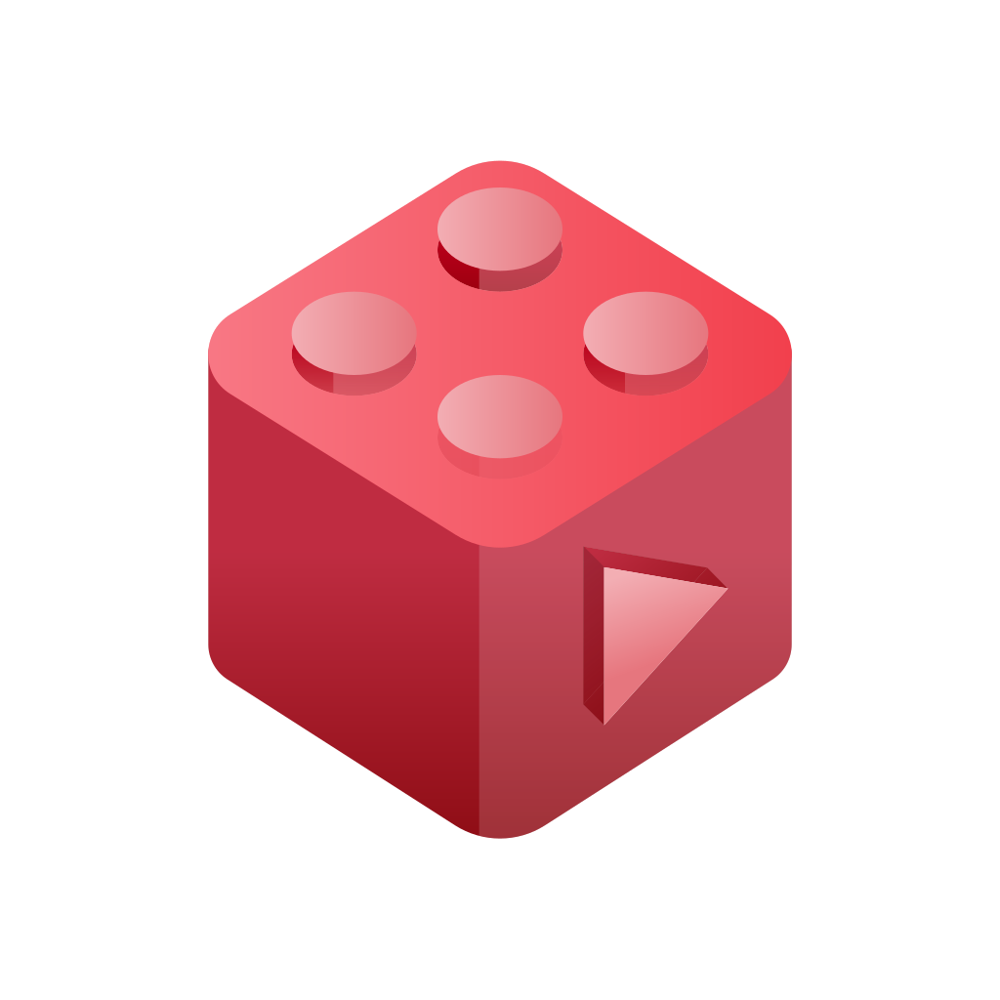

  

# YouTube API Legacy

This is a legacy YouTube API service that provides endpoints for fetching video information, channel data, and more. 
Part of the LegacyProjects initiative, bringing back the classic YouTube experience.  
This is a remaster of [this repository](https://github.com/zemonkamin/ytapilegacy).

## Installation

### Building from source
You will need [Rust](https://rust-lang.org/tools/install/) installed on your system.

1. Clone this repository with `git clone https://github.com/ZendoMusic/yt-api-legacy`
2. From the project folder, run `cargo build --release`
3. If you don't have errors, your file will be compiled in `target/release`

### Deploying
1. Download the latest version from the [releases page](https://github.com/ZendoMusic/yt-api-legacy/releases/).
2. Go to assets and [download the latest yt_dlp binary](https://github.com/yt-dlp/yt-dlp/releases/) for your system
3. Remove `.example` from `config.json.example` file.
4. Open `config.json` and edit it to suit your needs
5. Profit!

## License
This project is licensed under the MIT License - see the [LICENSE](./LICENSE) file for details.